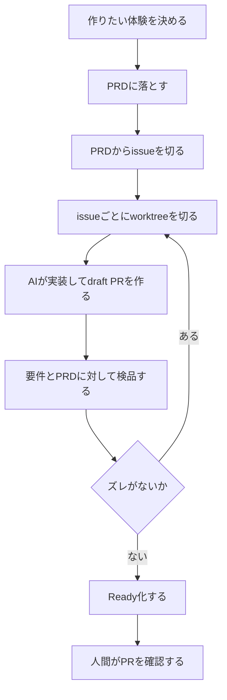

---

title: "full AIでCLIツール「tiny-view」を作った"
emoji: "🖼️"
type: "tech" # tech: 技術記事 / idea: アイデア
topics: ["rust", "ai", "個人開発", "claude", "cli"]
published: true
---

> ※本記事ではAIを活用して執筆しています。内容は自分でも確認し、適宜追記・修正を行っていますが、AI利用が苦手な方はご了承ください。

## はじめに

AIに実装をかなり任せて、`tiny-view` というCLIツールを作りました。

`tiny-view` は、HTML / Markdown / Mermaid / コード断片などを、サーバーも一時ファイルも使わずに、ネイティブWebViewでそのまま表示するための小さなツールです。

```bash
echo '<h1>Hello</h1>' | tinyview
```

これだけで小さなWebViewウィンドウが開いて、HTMLが表示されます。閉じれば状態は残りません。

リポジトリはこちらです。

[https://github.com/TakakiAraki09/tiny-view](https://github.com/TakakiAraki09/tiny-view)

今回やりたかったことは、大きく2つありました。

ひとつは、CLI上で扱っているテキストやMarkdownを、もう少し読みやすく確認したいということ。

もうひとつは、要件がある程度はっきりしている小さなツールを、どこまでAIに任せて作れるのかを試してみたいということでした。

結論から言うと、細かい実装を自分で全部追わなくても、「こういう体験にしたい」という部分を人間が決めて、PRDからissueに分けて、AIに実装とPR作成まで任せることで、CLIツールとして形にすることはできました。

もちろん、ものすごく複雑なプロダクトを作ったという話ではありません。どちらかというと、「ちょっとした便利ツールなら、AIにかなり任せてもここまで作れるんだな」と感じた、という話です。

でも、なんかこの感覚は自分の中では結構大きかったです。

## 何を解決したかったのか

CLIで作業していると、テキストを「ちょっと読みやすく見たいだけ」の場面がけっこうあります。

たとえば最近だと、AIにテスト内容をMarkdownで要約してもらったり、調査メモをHTMLやMarkdownで残したりすることが増えました。

AIが扱いやすい形として、HTMLやMarkdownを使うことも増えている気がします。

たとえば、テストが何を確認しているのかをAIにMarkdownで要約させて、`src/template.test.md` のようなファイルとして残したとします。

```bash
tinyview src/template.test.md -t markdown
```

もちろん、そのままターミナルで読むこともできます。エディタで開いてもいいです。

でも、長いMarkdownをターミナルで読むのは少しつらいですし、読むだけのためにエディタを開くのも、なんとなく気持ちが重いことがあります。

うまく言えないけど、「編集したい」わけではなくて、「読みやすい面で一度だけ確認したい」だけなんですよね。

自分は普段からNVIMにメモやチートシートのようなものを置くことが多いのですが、read onlyで見たいファイルは、ブラウザっぽい余白や行間で見られるとかなり助かります。

でもそのためだけに開発サーバーを立てたり、ブラウザタブを増やしたり、一時ファイルを作ったりするのは少し違うなと思っていました。

`tiny-view` は、その確認をこのくらい軽く済ませるためのツールです。

```text
CLIから入力
↓
読みやすいWebViewに表示
↓
閉じたら終わり
```

単にHTMLを開くだけなら、`open app.html` でも十分です。

ただ、自分が欲しかったのは、ブラウザタブでも、開発サーバーでも、プロジェクトでもなく、ターミナルの流れから離れすぎずに一度だけ表示して閉じるための小さな表示面でした。

## 主な機能と使い方

一番小さい使い方は、標準入力からHTMLを渡す形です。

```bash
echo '<button onclick="alert(1)">OK</button>' | tinyview
```

ファイルを直接開くこともできます。

```bash
tinyview app.html
```

インラインHTMLも渡せます。

```bash
tinyview --html '<h1>Hello</h1>'
```

テンプレートモードもあります。

```bash
# プレーンテキストとして表示
cat notes.txt | tinyview -t text

# Markdownをプレビュー
tinyview README.md -t markdown

# Mermaidをプレビュー
tinyview graph.mmd -t mermaid

# コードをハイライト表示
tinyview src/main.rs -t code --param lang=rust
```

基本のテンプレートはこの3つです。

| template  | 用途                        |
| --------- | ------------------------- |
| `raw`     | HTMLをそのまま表示する最速パス         |
| `text`    | plain textをエスケープして等幅表示    |
| `minimal` | HTML fragmentを最小のレイアウトで表示 |

加えて、Markdown / Mermaid / code preview は optional built-in として扱っています。

必要なライブラリはバイナリに埋め込み、使うときだけ単一HTMLへインライン化します。基本的には外部CDNを読みに行かないので、No Server / No Temp File という制約を崩さないようにしています。

ファイルを編集しながら見たい場合は、watch modeも使えます。

```bash
tinyview README.md --watch -t markdown
```

保存すると、同じWebView内で再読み込みされます。

`--watch` はファイル入力専用で、前景実行になります。つまり、止めたいときは `Ctrl+C` で止めます。

内部的には `Rust + wry + tao` で作っています。macOSではWKWebView、WindowsではWebView2、LinuxではWebKitGTKを使う形です。

Chromiumを同梱しないので、リリースバイナリは約1MB程度に収まっています。

最初はElectronのような選択肢も考えられるかなと思っていたのですが、今回はとにかく起動時の待ちを短くしたかったので、ネイティブWebViewを使う方向にしました。

小さな道具ほど、起動の一瞬の重さが気になる気がしています。

## 設計思想: No Server / No Temp File / Ephemeral

`tiny-view` で最初に決めた制約は、次の3つです。

```text
No Server
No Temp File
Ephemeral
```

この3つは、あとから決めたというより、最初に「これは守りたい」と思って置いたものです。

### No Server

ローカルHTTPサーバーを立てません。

`localhost:5173` も、`localhost:3000` も使いません。隠れたバックグラウンドサーバーもありません。

ポート番号を意識しなくていいですし、ポートが埋まっていて失敗することもありません。

HTMLを少し見たいだけなのに、裏でサーバーが立っているのは、なんとなく自分の感覚とは合いませんでした。

### No Temp File

プレビュー用のHTMLファイルを一時生成しません。

入力はメモリ上で読み、最終的には単一のHTML文字列としてWebViewへ渡します。

一時ファイルを作ってブラウザで開く方式でも、実用上はかなり簡単に作れると思います。

でも、閉じたあとにファイルが残るかどうかを気にしたり、どこに作ったかを気にしたりするのが嫌でした。

本当に一瞬だけ見たいものなので、余計な痕跡を残さない形にしたかったです。

### Ephemeral

閉じたら終わりです。

DOM state、JavaScript state、in-memory HTML、runtime session は、ウィンドウを閉じれば消えます。

デフォルトでは永続的なアプリ状態を持ちません。

これも、日記やメモを書く感覚に近いかもしれません。残したいものはファイルとして残すけれど、確認のために開いた表示状態までは残さなくていい、という感じです。

## パフォーマンス目標も先に置いた

この思想に合わせて、最初からパフォーマンス目標も置きました。

| Metric      | Target |
| ----------- | ------ |
| startup     | <150ms |
| first paint | <200ms |
| idle memory | <50MB  |
| binary size | <10MB  |

こういう数値は、AIに任せるときにもかなり効いたと思います。

「速くして」とだけ言うと、何を優先すればいいのか曖昧になります。

でも、

```text
startup <150ms
binary size <10MB
```

のように書いておくと、便利そうな依存を足すかどうか、起動時に設定ファイルを読むかどうか、optional templateを常に読み込むかどうか、みたいな判断がしやすくなります。

たとえば `raw` mode では、設定読み込み、テンプレート読み込み、marker置換をスキップして、入力HTMLをそのままWebViewに渡します。

```bash
echo '<h1>x</h1>' | tinyview
```

こういう一番小さい使い方を、最短経路にしたかったからです。

AIは便利にしようとして処理を足しがちな気がします。なので、「何をするか」だけではなくて、「何をしないか」も仕様に書くのが大事でした。

## テンプレートはできるだけ単純にした

テンプレートシステムも、あえて大きくしませんでした。

テンプレートは自己完結した単一HTMLファイルで、次のマーカーだけを持ちます。

```html
<script>
  window.__TINYVIEW__ = /*__TINYVIEW__*/ null /*__TINYVIEW__*/;
</script>
```

Rust側は、このマーカーを1回だけJSON literalに置換します。

```ts
window.__TINYVIEW__ = {
  input: string,
  params: Record<string, string>,
  title: string,
  path: string | null,
};
```

MarkdownやMermaidのパースも、基本的にはテンプレート側のJavaScriptに任せています。

Rust側に複雑なテンプレート言語やasset resolverを持たせるより、Rust側は「入力を単一HTMLとしてWebViewに渡す」ことに集中させたかったからです。

テンプレートはdotfile側で育てられるようにしました。

素朴なHTMLを置いてもいいし、必要ならViteなどでsingle file buildしたHTMLを置いてもいい。外部CSSやJS、テーマの都合は、Rust側の機能として増やすのではなく、最終的に単一HTMLにまとまっていればよい、という分け方です。

個人的には、この分け方がかなりしっくりきました。

本体は小さく保つ。でも、自分の読みやすさに関わる部分は、dotfile側で好きに育てられる。

小さなCLIツールとしては、そのくらいの距離感がちょうどいい気がしています。

## 外部アクセスはデフォルトでは閉じる

セキュリティ面では、デフォルト拒否に寄せています。

テンプレートから外部CDNなどを読みたい場合は、意図的に許可する形にしています。

```html
<meta name="tinyview-allow" content="fetch" />
```

このmetaをtemplateに入れることで、外部のCDNからJSを呼び出せるようにしています。

何でもできるようにしておくより、「このテンプレートでは外に取りに行く」と分かる形にしたかったです。

AIに実装を任せる場合、こういう境界も最初に書いておいたほうが安心でした。

## なぜAIに任せて作ったのか

一番大きな理由は、「要件がある程度決まっているものを、どこまでAIに任せられるのか」を試したかったからです。

`tiny-view` は、ただのHTML viewerというより、いくつか守りたい体験がありました。

* 簡単にファイルをプレビューできる
* processをブロックしすぎない
* macOS / Windows / Linux の差分を考える
* detach-by-defaultのプロセス制御を考える
* watch modeでファイル変更を拾う
* サーバーや一時ファイルに逃げない

自分で全部調べて実装することも、時間をかければできたと思います。

でも今回は、実装そのものよりも、「AIにどこまで任せて、人間はどこを見るべきなのか」を見たかったです。

作りたいものはわりとはっきりしていました。

CLIとしての入出力も明確ですし、画面も複雑なアプリではなく、WebViewにHTMLを渡すだけです。

なので、AIに任せる題材としてちょうどよかったのだと思います。

人間は `tiny-view` として守りたい体験に合っているかを見る。AIは実装やPR作成を進める。

今回は、その分担で進めました。

この記事自体も、かなり近い作り方をしています。

大見出しや書く内容、本文のたたき台はAIに出してもらい、人間が体験や言い回しを調整する形です。

開発でも記事でも、人間が構造や判断基準を持ち、AIが具体化し、人間が違和感を見る。そういう流れが、自分には合っている気がしました。

## 開発プロセス: Markdown駆動で進めた

実装に入る前に、まずPRDを作りました。

[https://github.com/TakakiAraki09/tiny-view/blob/main/docs/PRD.md](https://github.com/TakakiAraki09/tiny-view/blob/main/docs/PRD.md)

PRDには、機能一覧より先に「このプロダクトは何ではないか」を書いています。

ここもAIにかなり作ってもらったので、文章としては少し読みづらいところもあります。

でも、立ち位置としてはAIが参照できる「記憶」としてかなり役に立ちました。

とくに、次のような制約は強めにレビューしました。

* ローカルHTTPサーバーを立てない
* ポートを使わない
* プレビュー用の一時HTMLファイルを生成しない
* Chromiumを同梱しない
* 起動速度を最優先する
* `open` のように起動だけを行う形を取る

AIに「HTMLを表示するCLIを作って」とだけ頼むと、たぶん簡単にローカルサーバーを立てる方向へ行きます。

あるいは、一時HTMLを吐いてブラウザで開く実装になるかもしれません。

それ自体は悪くないと思います。むしろ普通に便利です。

でも、それをしてしまうと、今回自分が欲しかった `tiny-view` ではなくなってしまいます。

なので、先にPRDで絶対制約を固定しました。

```text
No Server
No Port
No Generated Preview File
Ephemeral Runtime
Native WebView
CLI First
Detach by default
```

こういう判断基準を先に渡しておくと、AIへの指示がかなり楽になります。

たとえば「watch modeを追加して」と頼む場合でも、PRDに次のような条件があると、AIはそこから実装できます。

* `--watch` は foreground でよい
* file input専用でよい
* 100ms debounceする

逆にPRDがないと、

* watch中もdetachするべきか
* stdinでもwatchできるべきか
* templateも毎回resolveし直すべきか

みたいなところで、実装がぶれやすくなります。

AI開発では、実装前に仕様の単一情報源を作ることがかなり効いたと思います。

## 実際の作業フロー

作業フローは、だいたい次の形でした。



この形にすると、人間が毎回コード全体を追わなくても、PRD、issue、PRという単位で確認できます。

自分はコードを全部読むよりも、Markdownで仕様や確認観点を読むほうが得意なので、この進め方はかなり相性がよかったです。

そのために、リポジトリ側には `.claude` を置いています。

中身は大きく2つです。

* `issue-batch-pr`
* `worktree-pr-workflow`

`issue-batch-pr` は、特定ラベルのissueを集めて、1 issue = 1単位で実装からPR作成まで回すためのものです。

どちらかというとPMやdispatcherに近い役割です。

対象issueの一覧を出し、人間からGoを取ってから、issueごとに実装を進めます。1件が失敗しても全体を止めず、最後にReady、draft、failedを集約して報告する形にしています。

`worktree-pr-workflow` は、1つの実装タスクを進めるためのものです。

必ず別worktreeで作業し、PRは最初にdraftで作ります。

その後、テスト / ビルド / lint、元issueの受け入れ条件、独立レビュー、CLAUDE.md / PRDの絶対条件という観点で検品します。

要件やPRDとのズレがあれば、そのPRをReadyにせず、修正iterationへ戻します。

全部通ったときだけReady化します。

さらに `.claude/hooks/require-worktree.sh` で、primary worktreeへの編集をブロックするようにしました。

AIがうっかりmain checkoutを直接編集しようとすると止まります。

プロンプトだけで「worktreeで作業してね」と言うより、hookでも止めるほうが安心でした。

このあたりは、仕事で運用ルールを決めるときの感覚に近いかもしれません。

「気をつける」だけではだいたい漏れるので、漏れたときに止まる場所を作っておく、という感じです。

## テストもMarkdownで読めるようにした

テストについても、コードを全部読む前提にはしませんでした。

AIにテストを書かせたうえで、「何を確認しているテストなのか」をMarkdownで要約させます。

実際に、次のようなファイルを置いています。

* `src/template.test.md`
* `src/webview.test.md`

人間はその要約を読んで、確認観点がPRDやissueと合っているかを見ます。

テストコードの細部は、必要なときだけ見る運用にしました。

これは個人的にかなりよかったです。

テストコードを読むのが嫌というより、まず「そのテストは何を守っているのか」を知りたいんですよね。

AIに実装を任せる場合、コードの正しさだけでなく、確認観点がずれていないかを見ることが大事だと思っています。

そのために、テストの説明をMarkdownで残すのはかなり効きました。

## 使ったツールと役割分担

開発の主役はAIです。

人間は、実装者というよりレビュアーに寄せました。

ざっくり分けると、次のような役割です。

| 役割                  | 担当 |
| ------------------- | -- |
| 作りたい体験を決める          | 人間 |
| PRDを作る              | AI |
| PRDをレビューする          | 人間 |
| PRDからissueを切る       | AI |
| 技術策定をする             | AI |
| issueごとにworktreeを切る | AI |
| Rustの実装を書く          | AI |
| テストを書く              | AI |
| テスト内容をMarkdownで要約する | AI |
| draft PRを作る         | AI |
| 検品を通ったPRをReady化する   | AI |
| PRを確認する             | 人間 |
| 体験とのズレを指摘する         | 人間 |

自分が細かいRustを書けなくても、CLIとしての期待値は判断できます。

たとえば、次のような観点はレビューできます。

* `echo '<h1>x</h1>' | tinyview` で余計な準備が走っていないか
* エラー時に親プロセスがnon-zeroで返るか
* `--watch` が本当にファイル入力専用になっているか
* `raw` pathに重い処理が混ざっていないか
* READMEの説明と実装がずれていないか
* テスト要約がPRDやissueの確認観点と合っているか
* PRの説明から変更の意図と影響範囲がわかるか
* draftのまま残ったPRに、人間が判断できるだけの状況説明があるか

実際、PRのコードを隅々まで読んだわけではありません。

どちらかというと、PRD、issue、README、テスト要約、PR説明といったMarkdownを中心に見ていました。

コードを書く比重は下がったと思います。

その代わり、「作りたい体験を言語化する力」や「仕様と成果物のズレに気づく力」の比重が上がった気がします。

## つまずいた点

正直そこまでつまづきは無かったように思えますが強いていうならCargoのAPI keyをローカルに置かないようにしました。

Github Secret に保存アクセスができないようにしました。

Actionsが汚染されてしまうとダメではあるので本来的にはCode pipeline等を利用し自分のパソコンからはawsへアクセスできないようにし「本当に見れないようにする」みたいなことは仕事で使う上では気にした方がいいんだろうなぁ、と感じてはおります。

### detach-by-default

`tinyview` は、`open file.png` のように、起動したらすぐシェルへ制御を返す設計にしています。

Unixでは `setsid` を使い、Windowsでは `DETACHED_PROCESS` を使う方向になります。

こういうOS差分は、自分で全部調べて書くには少し重い部分です。

ただ、PRDに次のように書いておくと、AIが実装方針を合わせやすくなりました。

* 親プロセスで入力読み込みを完了する
* テンプレート解決を親プロセス側で行う
* HTML合成まで親プロセス側で完了する
* 検証エラーは親が返す

つまり、ただdetachするだけではなく、失敗すべきところはちゃんと親プロセスが失敗として返す、ということです。

このあたりは、実装を任せる前に言葉にしておいてよかったと思っています。

ただLinuxの動作確認はしていません。

とりあえずwindows/macは動きました。

### raw fast path

起動速度を最優先にするなら、最もよく使う経路を軽くする必要があります。

`raw` modeでは、設定ファイルもテンプレートも読みません。

`--param` も関係しません。

入力HTMLをそのままWebViewへ渡します。

こういう「何もしない」設計は、意外と明示しないと入らない気がしました。

AIは便利にしようとして、設定を読んだり、共通処理を通したり、将来の拡張に備えたりしがちです。

もちろんそれが悪いわけではないです。

でも今回は、小さくて速いことを大事にしたかったので、「raw pathでは何をしないか」を仕様に入れました。

### templateをdotfileで育てられるようにする

テンプレートは、小さく保つこと自体が目的ではありません。

むしろ、自分の用途に合わせてファットになってよいものだと考えています。

たとえば、Markdownを読むときの余白、フォント、行間、コードブロックの見え方などは、人によってかなり好みが違います。

自分も、読むための画面には少しこだわりがあります。

なので、テンプレートはdotfile側で管理できるようにしました。

TinyView本体はテンプレートエンジンを持たず、単一HTMLファイルを読み、`window.__TINYVIEW__` のマーカーを置換してWebViewへ渡すだけです。

この形にしておけば、テンプレート側は自由にできます。

素朴なHTMLを置いてもいいし、必要ならViteなどでsingle file buildしたHTMLを置いてもいい。

外部CSSやJS、ライブラリ、テーマの都合は、Rust側の機能として増やすのではなく、最終的に単一HTMLにまとまっていればよい、という分け方です。

TinyView本体が守るのは、「入力を単一HTMLとしてWebViewへ渡す」契約だけです。

テンプレートをどれだけ厚くするかは、利用者のdotfileやビルド手段に任せます。

このほうが、長く使える道具になる気がしました。

### 数値目標を置く

「速くして」ではなく、数値で置いたのもよかったです。

```text
startup <150ms
first paint <200ms
idle memory <50MB
binary size <10MB
```

AIに判断させるとき、こういう数値はかなり効きます。

たとえば、

* 便利な依存を足すか
* 起動時にconfigを読むか
* optional templateを常に読み込むか
* raw modeでも共通処理を通すか

のような判断で、基準になります。

人間同士でもそうですが、「いい感じに軽く」だと解釈が分かれます。

数値にしておくと、迷ったときに戻る場所ができます。

## full AI開発をやってみた所感

今回のように、CLIの入力と出力が明確なツールは、AIとの相性が良いと感じました。

特に相性がよかったのは、次のような作業です。

* PRDを書く
* PRDからissueに分ける
* issueごとに実装する
* テストを書く
* テスト内容をMarkdownで要約する
* PR説明を書く
* 仕様とのズレを検品する

一方で、人間が持っておく必要があるものもあると思いました。

それは、コードを全部書く力というより、次のようなものです。

* 作りたい体験を短く言語化する力
* 何をしないかを決める力
* PRD、issue、PRのつながりを見る力
* 実装が体験から外れていないか見る力
* READMEと実装のズレに気づく力
* テスト要約を読んで確認観点の不足に気づく力

AIに任せると、人間の仕事がなくなるというより、人間が見る場所が変わるのだと思います。

自分の場合は、コードを細かく書く時間よりも、Markdownを読みながら「これは自分が欲しかった体験に合っているか」を考える時間のほうが増えました。

それがいいことなのかは、まだ分かりません。

でも、少なくとも今回のような個人開発では、かなり気持ちよく進められました。

普段から日記やメモを書く習慣がある人は、このやり方と相性がいいかもしれませんね。

アイデア帳みたいなものが実は今は大事なのかもしれません。

作りたいものを言葉にして、AIが処理しやすい単位に分けて、戻ってきたものをまた言葉で確認する。

サッと思ったものが形になるのはとても心地が良かったです。

## まとめ

`tiny-view` は、CLIで扱うHTML / Markdown / Mermaid / コード断片などを、サーバーも一時ファイルも使わずに、ネイティブWebViewでさっと表示するためのツールです。

サーバーを立てず、ポートを使わず、一時HTMLファイルも作らず、閉じたら状態が消える。

CLIで扱う長いテキストや、Markdownにまとめたテスト説明を読みやすく確認したいときに使えます。

今回の開発では、コードをほぼ書かず、作りたい体験を固定し、PRDからissue、issueからworktree、worktreeからdraft PRへ流すことで、CLIツールを形にできました。

個人的には、AI開発で大事なのは「AIに全部いい感じに任せること」ではなく、「作りたい体験を固定し、AIが処理しやすい単位に分けて渡すこと」なのだと思いました。

小さなツールではありますが、自分にとっては、AIとの開発の距離感を掴むいい題材になりました。

```bash
cargo install tinyview
```

[https://github.com/TakakiAraki09/tiny-view](https://github.com/TakakiAraki09/tiny-view)

